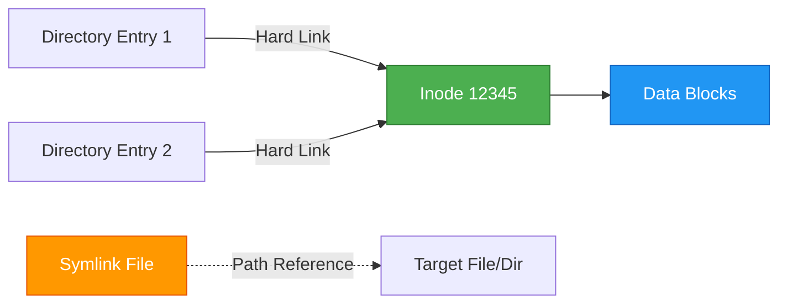
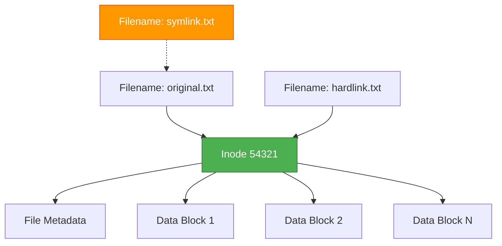
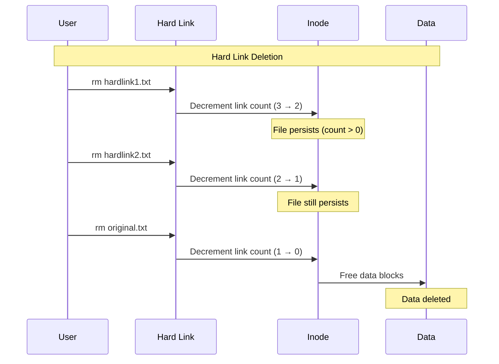
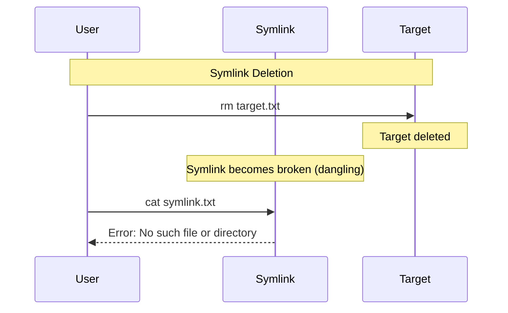

<div align="center">

# 🔗 Hard Link vs Symbolic Link

### The Complete Guide to Linux/Unix File Linking

[](https://www.kernel.org/)

*Master the art of file linking with comprehensive explanations, practical examples, and best practices.*

[Quick Start](#-quick-start) • [Documentation](#-concepts) • [Examples](#-real-world-examples) • [Cheat Sheet](#-cheat-sheet)

</div>

---

## 📋 Table of Contents

- [Overview](#-overview)
- [Quick Summary](#-quick-summary)
- [Core Concepts](#-core-concepts)
- [Practical Commands](#-practical-commands)
- [Real-World Examples](#-real-world-examples)
- [Use Cases](#-use-cases)
- [Cheat Sheet](#-cheat-sheet)
- [Platform Support](#-platform-support)
- [Best Practices](#-best-practices)
- [Troubleshooting](#-troubleshooting)
- [Contributing](#-contributing)
- [License](#-license)

---

## 🎯 Overview

Understanding file links is crucial for efficient file management, backup strategies, and deployment workflows in Linux/Unix systems. This guide provides everything you need to know about **hard links** and **symbolic (soft) links**.

### Why This Matters

- 💾 **Save Disk Space** - Share data blocks across multiple file references
- 🚀 **Atomic Deployments** - Switch between versions instantly
- 🔄 **Efficient Backups** - Create snapshots without duplicating unchanged files
- 🔗 **Flexible Organization** - Create logical file structures without moving data

---

## 🧠 Quick Summary

<div align="center">

| Feature | Hard Link | Symbolic Link |
|:-------:|:---------:|:-------------:|
| **Icon** | 📎 | 🔗 |
| **Same Inode** | ✅ Yes | ❌ No |
| **Cross Filesystem** | ❌ No | ✅ Yes |
| **Works with Directories** | 🚫 No* | ✅ Yes |
| **Survives Target Deletion** | ✅ Yes | ❌ No (becomes broken) |
| **Performance** | ⚡ Fast (direct) | ⚡ Fast (one extra lookup) |
| **Primary Use Case** | Backups, snapshots | Shortcuts, deployments |

<sub>*Hard links to directories are typically restricted to prevent cycles</sub>

</div>

### At a Glance



---

## 🏗️ Core Concepts

### Understanding Inodes

Every file on a Unix/Linux filesystem is represented by an **inode** (index node) which stores:
- File metadata (permissions, timestamps, owner)
- Pointers to data blocks
- Link count (number of hard links)



### Hard Links Explained

A **hard link** is simply another name (directory entry) pointing to the same inode.

**Key Characteristics:**
- Multiple names → Same content
- Same permissions, ownership, timestamps
- Deleting one link doesn't affect others
- File data persists until **all** links are removed
- Limited to same filesystem partition

```bash
# All three names reference the SAME file
original.txt  ──┐
hardlink1.txt ──┼─→ Inode 12345 → Data Blocks
hardlink2.txt ──┘
```

### Symbolic Links Explained

A **symbolic (soft) link** is a special file containing the path to another file or directory.

**Key Characteristics:**
- Separate inode with path data
- Can cross filesystem boundaries
- Can point to directories
- Becomes "broken" if target is moved/deleted
- Requires an extra filesystem lookup

```bash
symlink.txt → "/path/to/original.txt" → Inode 54321 → Data
```

### Deletion Behavior





---

## 💻 Practical Commands

### Creating Links

```bash
# Create a hard link
ln /path/to/original.txt /path/to/hardlink.txt

# Create a symbolic link (absolute path)
ln -s /path/to/original.txt /path/to/symlink.txt

# Create a symbolic link (relative path)
ln -s ../original.txt ./symlink.txt

# Create a symbolic link to a directory
ln -s /path/to/directory /path/to/link-to-directory

# Force overwrite existing link
ln -sf /new/target existing-link

# Create link with atomic replacement (for deployments)
ln -sfn /releases/v2.0 /var/www/current
```

### Inspecting Links

```bash
# List files with inode numbers
ls -li
# Output: 54321 -rw-r--r-- 3 user group 1234 Nov 5 10:00 file.txt

# Show detailed file stats including link count
stat original.txt

# Show where a symlink points
readlink symlink.txt

# Resolve symlink to final target (follow all links)
realpath symlink.txt

# Find all hard links to a specific inode
find /path -inum 54321

# Find all hard links to a specific file
find /path -samefile original.txt

# List all symbolic links in a directory
find /path -type l

# Find broken symbolic links
find /path -xtype l

# Show file type
file symlink.txt
# Output: symlink.txt: symbolic link to original.txt
```

### Inspecting Output Examples

```bash
$ ls -li
total 12
54321 -rw-r--r-- 3 user group 1234 Nov 5 10:00 original.txt
54321 -rw-r--r-- 3 user group 1234 Nov 5 10:00 hardlink1.txt
54321 -rw-r--r-- 3 user group 1234 Nov 5 10:00 hardlink2.txt
98765 lrwxrwxrwx 1 user group   12 Nov 5 10:01 symlink.txt -> original.txt
```

**Understanding the output:**
- `54321` - Inode number (same for all hard links)
- `-rw-r--r--` - File permissions
- `3` - Hard link count (three names for this file)
- `lrwxrwxrwx` - The `l` indicates a symbolic link
- `->` - Shows symlink target

---

## 🧩 Real-World Examples

### Example 1: Efficient Incremental Backups

Create space-efficient snapshots where unchanged files are hard-linked:

```bash
#!/bin/bash
# Incremental backup script using hard links

SOURCE="/home/user/data"
BACKUP_ROOT="/backups"
DATE=$(date +%Y-%m-%d_%H-%M-%S)
LATEST="${BACKUP_ROOT}/latest"
NEW_BACKUP="${BACKUP_ROOT}/backup-${DATE}"

# Create new backup directory
mkdir -p "$NEW_BACKUP"

# Use rsync with hard links to previous backup
if [ -d "$LATEST" ]; then
    # Link unchanged files, copy new/modified files
    rsync -a --link-dest="$LATEST" "$SOURCE/" "$NEW_BACKUP/"
else
    # First backup
    rsync -a "$SOURCE/" "$NEW_BACKUP/"
fi

# Update 'latest' symlink
ln -sfn "$NEW_BACKUP" "$LATEST"

echo "Backup completed: $NEW_BACKUP"
```

**Result:** Multiple daily backups that only consume space for changed files!

```bash
$ du -sh /backups/*
2.5G    /backups/backup-2025-11-01
150M    /backups/backup-2025-11-02  # Only changed files
200M    /backups/backup-2025-11-03  # Only changed files
```

### Example 2: Zero-Downtime Deployment

Atomic switching between application versions:

```bash
# Project structure
/var/www/releases/
├── release-v1.0.0/
├── release-v1.1.0/
├── release-v1.2.0/
└── release-v2.0.0/

/var/www/current -> /var/www/releases/release-v1.2.0

# Deploy new version
./deploy.sh v2.0.0

# Instantly switch (atomic operation)
ln -sfn /var/www/releases/release-v2.0.0 /var/www/current

# Rollback if needed (instant)
ln -sfn /var/www/releases/release-v1.2.0 /var/www/current
```

**Benefits:**
- ✅ Zero downtime during deployment
- ✅ Instant rollback capability
- ✅ Multiple versions coexist safely

### Example 3: Managing Configuration Files

```bash
# Keep configs in version control
~/dotfiles/
├── .bashrc
├── .vimrc
└── .gitconfig

# Create symlinks in home directory
ln -s ~/dotfiles/.bashrc ~/.bashrc
ln -s ~/dotfiles/.vimrc ~/.vimrc
ln -s ~/dotfiles/.gitconfig ~/.gitconfig

# Benefits: Edit once, version controlled, easy to sync across machines
```

### Example 4: File Deletion with Open Processes

```bash
# Create a large log file
echo "Important data" > /tmp/important.log

# Process opens and keeps file open
tail -f /tmp/important.log &
PID=$!

# Create hard link for safety
ln /tmp/important.log /tmp/important.log.backup

# Delete original (data persists because of hard link + open descriptor)
rm /tmp/important.log

# Check disk usage - file still exists!
ls -li /tmp/important.log.backup

# Process still reads the file!
# Data is only freed when:
# 1. All hard links are removed, AND
# 2. All processes close the file descriptor
```

### Example 5: Organizing Media Libraries

```bash
# Original media organized by date
/media/originals/
├── 2025/
│   ├── 01-January/
│   └── 02-February/

# Create thematic collections using symlinks
/media/collections/
├── vacations/
│   ├── summer-2025.jpg -> ../../originals/2025/06-June/beach.jpg
│   └── winter-2025.jpg -> ../../originals/2025/12-December/ski.jpg
└── portraits/
    ├── portrait1.jpg -> ../../originals/2025/03-March/portrait.jpg
    └── portrait2.jpg -> ../../originals/2025/07-July/photo.jpg

# Benefits: Same files in multiple logical organizations without duplication
```

---

## 🎯 Use Cases

### When to Use Hard Links

| Scenario | Why Hard Links | Benefits |
|----------|----------------|----------|
| 🗄️ **Backup Systems** | Unchanged files share data blocks | Save massive disk space |
| 📸 **Snapshots** | Point-in-time copies | Instant snapshots, minimal space |
| 🔒 **Data Safety** | File persists until all links removed | Protection against accidental deletion |
| ⚡ **Same Filesystem** | Direct inode access | Maximum performance |
| 🔄 **Deduplication** | Multiple identical files | Automatic space optimization |

### When to Use Symbolic Links

| Scenario | Why Symlinks | Benefits |
|----------|--------------|----------|
| 🚀 **Deployments** | Point to current version | Zero-downtime switching |
| 📁 **Directories** | Link entire directory trees | Logical organization |
| 💿 **Cross-Filesystem** | Link to external drives/mounts | Flexibility |
| 🔗 **Shortcuts** | User-friendly paths | Easier navigation |
| ⚙️ **Configuration** | Point to active configs | Dynamic configuration |
| 🌐 **Web Roots** | `/var/www/current` → version | Easy version management |

---

## ⚡ Cheat Sheet

### Quick Reference

```bash
# ============================================
#  CREATION
# ============================================

# Hard link
ln TARGET LINK_NAME

# Soft link (absolute)
ln -s /absolute/path/to/TARGET LINK_NAME

# Soft link (relative)  
ln -s ../TARGET LINK_NAME

# Force overwrite
ln -sf TARGET LINK_NAME

# Atomic replacement (deployments)
ln -sfn TARGET LINK_NAME

# ============================================
#  INSPECTION
# ============================================

# Show inode numbers
ls -li

# Detailed stats
stat FILE

# Show link target
readlink LINK

# Resolve final target
realpath LINK

# Find by inode
find . -inum INODE_NUMBER

# Find hard links to file
find . -samefile FILE

# List all symlinks
find . -type l

# Find broken symlinks
find . -xtype l

# ============================================
#  DELETION
# ============================================

# Remove link (not target)
rm LINK_NAME
unlink LINK_NAME

# Remove target (symlinks break)
rm TARGET

# ============================================
#  COMPARISON
# ============================================

# Check if same file
[ file1 -ef file2 ] && echo "Same" || echo "Different"

# Count hard links
stat -c %h FILE
```

### Decision Matrix

```
Need to link to directory?
├─ Yes → Use symlink
└─ No
    │
    Cross filesystem boundary?
    ├─ Yes → Use symlink
    └─ No
        │
        Need atomic switching?
        ├─ Yes → Use symlink
        └─ No
            │
            Space-efficient backups?
            ├─ Yes → Use hard link
            └─ No → Either works (prefer symlink for flexibility)
```

---

## 🪟 Platform Support

### Linux/Unix

Native support for both hard and symbolic links.

```bash
# Hard link
ln original.txt hardlink.txt

# Symbolic link
ln -s original.txt symlink.txt
```

### macOS

Full support (Unix-based).

```bash
# Same as Linux
ln original.txt hardlink.txt
ln -s original.txt symlink.txt
```

### Windows

NTFS supports both, but requires special permissions for symlinks.

#### Command Prompt

```cmd
REM Hard link (file)
mklink /H hardlink.txt original.txt

REM Symbolic link (file) - requires admin or Developer Mode
mklink symlink.txt original.txt

REM Symbolic link (directory)
mklink /D linkdir targetdir

REM Junction (directory, no admin required)
mklink /J linkdir targetdir
```

#### PowerShell

```powershell
# Symbolic link (requires admin or Developer Mode)
New-Item -ItemType SymbolicLink -Path link -Target target

# Hard link
New-Item -ItemType HardLink -Path link -Target target

# Enable Developer Mode to create symlinks without admin:
# Settings > Update & Security > For developers > Developer mode
```

### WSL (Windows Subsystem for Linux)

Full Linux compatibility.

```bash
# Works exactly like native Linux
ln original.txt hardlink.txt
ln -s original.txt symlink.txt
```

---

## 🧭 Best Practices

### ✅ Do's

1. **Use relative symlinks for portability**
   ```bash
   # Good - works when directory moves
   ln -s ../config.yaml ./app/config.yaml
   
   # Bad - breaks when directory moves
   ln -s /home/user/project/config.yaml ./app/config.yaml
   ```

2. **Use `ln -sfn` for atomic deployments**
   ```bash
   # Atomic replacement (no intermediate state)
   ln -sfn /releases/new-version /var/www/current
   ```

3. **Hard link for backup efficiency**
   ```bash
   # Space-efficient backups
   cp -al /data /backup/snapshot-$(date +%F)
   ```

4. **Document your link structure**
   ```bash
   # Add README explaining the links
   # /var/www/current -> /releases/v1.2.0
   ```

5. **Verify links before critical operations**
   ```bash
   # Check if symlink is valid
   [ -L "$link" ] && [ -e "$link" ] && echo "Valid" || echo "Broken"
   ```

### ❌ Don'ts

1. **Don't hard link across filesystems** (it's impossible)
   ```bash
   # This will fail
   ln /home/user/file.txt /mnt/external/hardlink.txt
   ```

2. **Don't rely on hard link count for security**
   ```bash
   # Unreliable - link count can be manipulated
   ```

3. **Don't create circular symlink chains**
   ```bash
   # Bad - causes infinite loops
   ln -s linkB linkA
   ln -s linkA linkB
   ```

4. **Don't use absolute paths in portable projects**
   ```bash
   # Bad for Docker, VMs, etc.
   ln -s /home/user/app/config.yaml ./config.yaml
   ```

5. **Don't forget to clean up broken links**
   ```bash
   # Remove dangling symlinks regularly
   find /path -xtype l -delete
   ```

---

## 🔍 Troubleshooting

### Common Issues and Solutions

#### 1. "ln: failed to create hard link: Invalid cross-device link"

**Cause:** Trying to create hard link across different filesystems.

**Solution:** Use symbolic link instead.
```bash
ln -s /mnt/external/file.txt ./hardlink.txt
```

#### 2. Broken symbolic links

**Find them:**
```bash
find /path -xtype l
```

**Fix them:**
```bash
# Remove broken links
find /path -xtype l -delete

# Or update target
ln -sf /new/target broken-link
```

#### 3. "Too many levels of symbolic links"

**Cause:** Circular symlink chain.

**Solution:** Find and break the cycle.
```bash
# Find symlinks in directory
find . -type l -ls

# Remove circular link
rm problematic-link
```

#### 4. Hard link count seems wrong

**Cause:** Hidden hard links (common in system directories).

**Solution:** Find all links to the file.
```bash
# Find all hard links to a file
find / -samefile /path/to/file 2>/dev/null

# Or by inode
find / -inum $(stat -c %i /path/to/file) 2>/dev/null
```

#### 5. Symlink permission denied on Windows

**Cause:** Requires admin rights or Developer Mode.

**Solution:** Enable Developer Mode or run as administrator.
```powershell
# Enable Developer Mode in Settings
# Settings > Update & Security > For developers > Developer mode
```

### Verification Commands

```bash
# Verify link type
file suspicious-link

# Check if two files are hard linked
[ file1 -ef file2 ] && echo "Hard linked" || echo "Not linked"

# Verify symlink target exists
[ -L symlink ] && [ -e symlink ] && echo "Valid" || echo "Broken"

# Show all file information
stat -c "Inode: %i, Links: %h, Type: %F" filename
```

---

## 📚 Additional Resources

- [Linux `ln` man page](https://man7.org/linux/man-pages/man1/ln.1.html)
- [Understanding Unix Filesystem](https://www.kernel.org/doc/html/latest/filesystems/)
- [POSIX Standard](https://pubs.opengroup.org/onlinepubs/9699919799/)
- [GNU Coreutils Documentation](https://www.gnu.org/software/coreutils/manual/)

---

## 🤝 Contributing

Contributions are welcome! Please feel free to submit a Pull Request. For major changes:

1. Fork the repository
2. Create your feature branch (`git checkout -b feature/AmazingFeature`)
3. Commit your changes (`git commit -m 'Add some AmazingFeature'`)
4. Push to the branch (`git push origin feature/AmazingFeature`)
5. Open a Pull Request

### Areas for Contribution

- 📖 Additional examples and use cases
- 🐛 Bug reports and corrections
- 🌍 Translations to other languages
- 💡 Performance tips and tricks
- 🔧 Platform-specific guides (BSD, Solaris, etc.)

---

## 📄 License

This project is licensed under the MIT License - see below for details.

```
MIT License

Copyright (c) 2025 [Your Name]

Permission is hereby granted, free of charge, to any person obtaining a copy
of this software and associated documentation files (the "Software"), to deal
in the Software without restriction, including without limitation the rights
to use, copy, modify, merge, publish, distribute, sublicense, and/or sell
copies of the Software, and to permit persons to whom the Software is
furnished to do so, subject to the following conditions:

The above copyright notice and this permission notice shall be included in all
copies or substantial portions of the Software.

THE SOFTWARE IS PROVIDED "AS IS", WITHOUT WARRANTY OF ANY KIND, EXPRESS OR
IMPLIED, INCLUDING BUT NOT LIMITED TO THE WARRANTIES OF MERCHANTABILITY,
FITNESS FOR A PARTICULAR PURPOSE AND NONINFRINGEMENT. IN NO EVENT SHALL THE
AUTHORS OR COPYRIGHT HOLDERS BE LIABLE FOR ANY CLAIM, DAMAGES OR OTHER
LIABILITY, WHETHER IN AN ACTION OF CONTRACT, TORT OR OTHERWISE, ARISING FROM,
OUT OF OR IN CONNECTION WITH THE SOFTWARE OR THE USE OR OTHER DEALINGS IN THE
SOFTWARE.
```

---

## ⭐ Star History

If you find this guide helpful, please consider giving it a star! ⭐

---

<div align="center">

### Made with ❤️ for the Linux/Unix community

**[⬆ Back to Top](#-hard-link-vs-symbolic-link)**

</div>
